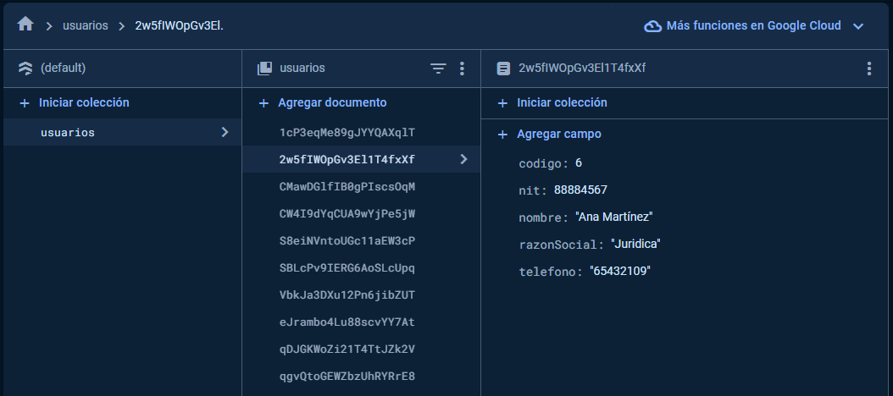

# dropdown# Proyecto de Base de Datos Firebase con Búsqueda por Código

Este proyecto utiliza Firebase como base de datos y está desarrollado en React con la configuración de Vite. Su objetivo es permitir la búsqueda por código en la base de datos.

## Características

- Integración completa con Firebase.
- Visualización de los siguientes campos:
  - Nombre
  - Razón social (Natural o Jurídica)
  - NIT
  - Teléfono
  - Código
- Búsqueda por código implementada parcialmente.

## Configuración

1. Clona este repositorio en tu máquina local.
2. Instala las dependencias con `npm install`.
3. Configura tu proyecto en Firebase y obtén las credenciales.
4. Coloca las credenciales de Firebase en el archivo de configuración `firebaseConfig.js`.
5. Ejecuta el proyecto con `npm run dev`.

## Capturas de Pantalla

Aquí se muestran algunas imágenes del proyecto en funcionamiento:

La base de datos en firestore

## Autor

Este proyecto fue desarrollado por [Wara Pacajes].
